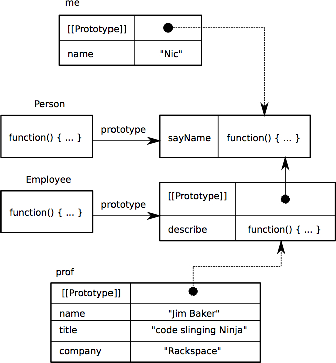

## New Class Syntax in JavaScript

By Nicandro Flores, Megan Greening, and Brian McWilliams
Our paper and presentation slides are on github
https://github.com/Meglet/CSCI3155Paper

---

## Outline

 + Background on our topic
 + Old vs. New Syntax
 + Pros and Cons

---

## How did we get here?

The JavaScript Specification

 + ECMAScript is the JS specifiaction
   http://www.ecma-international.org/ecma-262/5.1/
              
 + TC39: group in charge of writing ECMAScript6
   http://www.ecma-international.org/memento/TC39.htm

 + The new spec will be out in late 2013

---

## Prototype chain diagram

---

## Constructor Functions

~~~~javascript
    > function Person(name) {
      this.name = name;
      }
    > Person.hasOwnProperty('name') // => true
    > Person.prototype              // => {}
    > Person.prototype.sayName = function() { 
        return "Hi I am a Person and my name is: " + this.name; 
      };
    > Person.prototype              // => { sayName: [Function] }
    > function Employee(name,title,company) {
        Person.call(this,name);
        //Person.apply(this,['name']);
        this.title = title;
        this.company = company;
      }
~~~~

---

## Prototype Inheritance

~~~~javascript
    > function Employee(name,title,company) {
        Person.call(this,name);
        //Person.apply(this,['name']);
        this.title = title;
        this.company = company;
      }
    > Employee.prototype = new Person('John Doe','TBD','Unemployed');
    > Employee.prototype.constructor = Employee;
    > Employee.prototype.describe = function() {
        return Person.prototype.sayName.call(this,this.name) 
               + ", I am a " + this.title + " at " 
               + this.company + "!";
      }
~~~~

---

## Now let's make some instances of these objects/classes

~~~~javascript
    > var me = new Person('Nic');
    > var prof = new Employee('Jim Baker','code slinging Ninja','Rackspace');
    > console.log(me.sayName());
      Hi I am a Person and my name is: Nic
    > console.log(prof.sayName());
      Hi I am a Person and my name is: Jim Baker
    > console.log(prof.describe());
      Hi I am a Person and my name is: Jim Baker, 
      I am a code slinging Ninja at Rackspace!
~~~~

---

## Maximally Minimal Classes

 + A Class keyword
 + A body that includes the constructor function and instance methods
 + Cand declare a class as a subclass of another class using extends
 + Super is available from any of the methods or the constructor

---

### Formal Class Grammar

<Note/speaking> When we began gathering resources for this topic, we were suprised to be able to apply what we just learned.  The task group was describing the new feature in Backus–Naur Form.   Here we see the top level Class definition.  It is a little harder to make out than what we did, but we can see that ClassDeclaration returns a Binding Identifier and a Class Tail, then a ClassTail.
<End speaking>

Class BNF

<pre>
ClassDeclaration: class BindingIdentifier ClassTail
ClassExpression: class BindingIdentifieropt ClassTail
ClassTail: ClassHeritageopt{ ClassBodyopt}
ClassHeritage : extends AssignmentExpression 
ClassBody: ClassElementList 
ClassElementList: 
    ClassElement 
    ClassElementList ClassElement 
ClassElement:
    MethodDefinition;
MethodDefinition :
    PropertyName(FormalParameterList) {FunctionBody}
    *PropertyName(FormalParameterList){FunctionBody}
    get PropertyName ( ){FunctionBody}
    set PropertyName(PropertySetParameterList) {FunctionBody}
</pre>
<align = right>
July 26, 2012 TC39 Meeting Notes Allen Wirfs-Brock http://t.co/PwuF12Y0
</align>

---

## Parsing of Judgement Forms

<pre>
Static Semantics: ConstructorMethod
ClassBody : ClassElementList
  1. Let list be PrototypeMethodDefinitions of ClassElementList.
  2. For each MethodDefinition m in list, do
    a. If PropName of m is ″constructor″, return m.
  3. Return empty.

Static Semantics: Contains
ClassTail : ClassHeritageopt { ClassBody }
1. If symbol is ClassBody, return true.
2. If ClassHeritage is not present, return false.
3. If symbol is ClassHeritage, return true.
4. Return the result of Contains for ClassHeritage 
   with argument symbol.
</pre>

---

## From Prototype to Classes

~~~~javascript
// Supertype
    class Person {
        constructor(name) { this.name = name; }
        describe() { return "Person called "+this.name; }
    }
// Subtype
    class Employee extends Person {
        constructor(name, title) {
            super.constructor(name);
            this.title = title;
        }
        describe() { return super.describe() + this.title; }
    }
~~~~

---

## How Classes Will Be Used

~~~~javascript
> let prof = new Employee("Jim Baker", "code slinging Ninja");
> prof instanceof Person
  true
> prof instanceof Employee
  true
> prof.describe()
  Hi I am a Person and my name is: Jim Baker, 
  I am a code slinging Ninja!
~~~~

---

## Main Arguments Against

The new syntax will add complexity
It is just sugar
Minimal classes are redundant

---

## Classes May Add Complexity

Adding common features of classes (inheritance, subclasses, etc) 
will obscure the inner workings of JS

---

## Prototype Classes Work

You can always write your own JS function to extend CF
~~~~javascript
function extend(Child, Parent) {
     var F = function(){};
     F.prototype = Parent.prototype;
     Child.prototype = new F();
     Child.prototype.constructor = Child;
     Child.uber = Parent.prototype;
}
~~~~
or use Proto.js
https://github.com/rauschma/proto-js

---

## What's the point of Minimal Classes

There will be TWO ways of creating classes and that may lead to errors later on

---

## The need for classes in JS

When they (newcomers) arrive to JavaScript their concepts of how an object-oriented language works no longer apply. They learn that their big OOP investment was not complete. -Peter Michaux

---

## Professional Learning Resources
Amazon.com results that refer to:
  + "prototype inheritance javascript":  <pre>N(14)</pre>
  + "class inheritance":  <pre>N(3001)</pre>

---

## Conclusion

+ Its happening!
+ Its just syntactic sugar for prototypical classes

---
